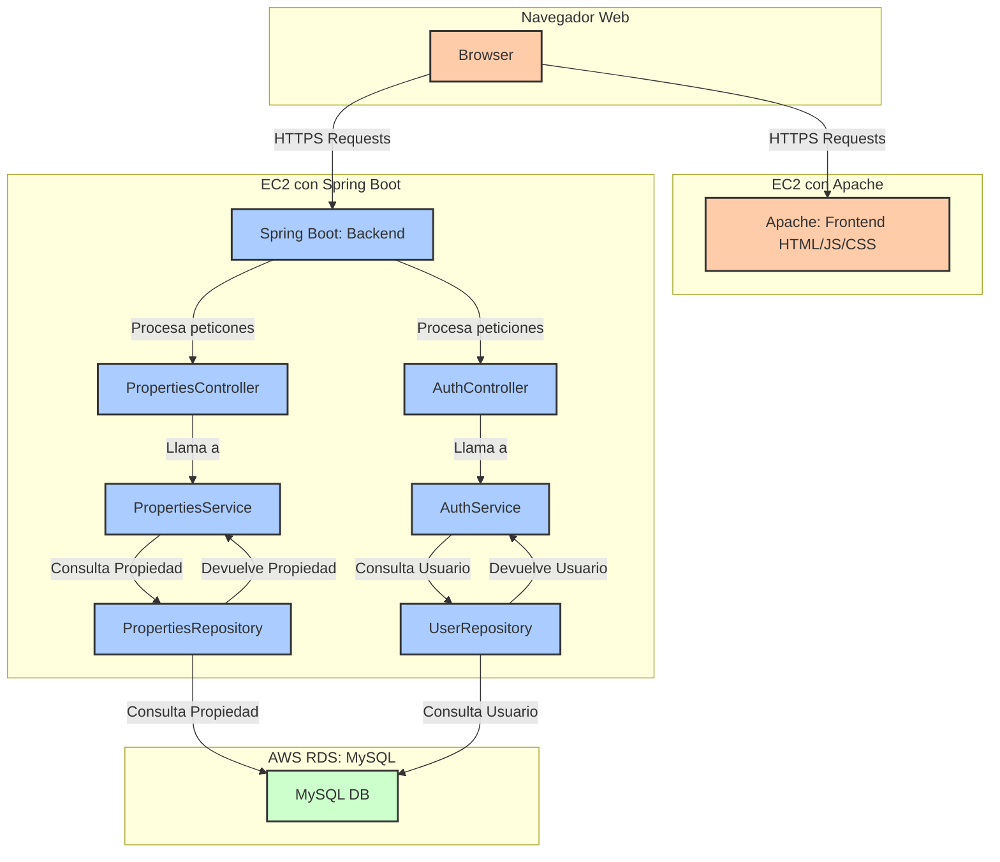

# Taller 

## Sistema de Gestión de Propiedades

Esta es una aplicación web diseñada para la gestión de propiedades inmobiliarias, que permite a los usuarios realizar operaciones CRUD (Crear, Leer, Actualizar, Eliminar) sobre las propiedades. Los usuarios pueden registrar propiedades con detalles como precio, tamaño, dirección y descripción. Además, la aplicación cuenta con un sistema de autenticación que asegura el acceso mediante registro e inicio de sesión, con contraseñas almacenadas de manera segura utilizando hashing.
## Funcionalidades

### Gestión de Propiedades
- Crear: Los usuarios pueden registrar propiedades con información relevante.
- Leer: Visualización de una lista de todas las propiedades registradas.
- Actualizar: Modificar detalles de propiedades existentes. 
- Eliminar: Borrar propiedades que ya no son necesarias.
El sistema está compuesto por un frontend desarrollado en HTML y JavaScript que se comunica con un backend RESTful construido en Spring Boot, utilizando una base de datos MySQL para el almacenamiento persistente de datos.

### Sistema de Autenticación
- Registro de Usuarios: Los usuarios pueden crear una cuenta proporcionando un nombre de usuario y contraseña.
- Inicio de Sesión: Acceso a la plataforma mediante credenciales registradas.
- Seguridad: Las contraseñas se almacenan de manera segura utilizando un algoritmo de hash, garantizando la protección de los datos sensibles.

## Comenzando

Las siguientes instrucciones te permitirán obtener una copia del proyecto en funcionamiento en tu máquina local para fines de desarrollo y pruebas.

### Construido con:

* [Git](https://git-scm.com) - Control de versiones
* [Maven](https://maven.apache.org/download.cgi) - Manejador de dependencias
* [Java](https://www.oracle.com/java/technologies/downloads/#java22) - Lenguaje de programación

### Requisitos:

#### ⚠️ Importante

Es necesario tener instalado Git, Maven 3.9.9 y Java 17 para ejecutar el proyecto.

# Arquitectura de la Aplicación

## Cliente - Servidor



# Explicación de la Arquitectura

## 1. Frontend (Cliente)

- **Tecnologías:** HTML, JavaScript, CSS
- **Descripción:** El frontend se encuentra alojado en una instancia de EC2 que ejecuta Apache. Se encarga de la interfaz de usuario y la experiencia del cliente. Los usuarios interactúan con la aplicación a través de un navegador web, enviando solicitudes HTTPS al servidor. La comunicación con el backend se realiza mediante llamadas a API, permitiendo al usuario realizar operaciones como registro, inicio de sesión y gestión de propiedades.

## 2. Backend (Servidor)

- **Tecnologías:** Spring Boot
- **Descripción:** El backend también se encuentra en una instancia de EC2 y es responsable de procesar las solicitudes del frontend. Utiliza el framework Spring Boot para manejar la lógica de negocio y las interacciones con la base de datos. Este componente se encarga de las operaciones de autenticación, gestión de usuarios y propiedades.

   - **Controladores:**
      - **AuthController:** Maneja las solicitudes de autenticación (registro e inicio de sesión).
      - **PropertiesController:** Gestiona las operaciones relacionadas con las propiedades.

   - **Servicios:**
      - **AuthService:** Contiene la lógica de autenticación, como verificar las credenciales del usuario.
      - **PropertiesService:** Encargado de manejar las operaciones sobre las propiedades.

   - **Repositorios:**
      - **UserRepository:** Interactúa con la base de datos para gestionar los datos de usuario.
      - **PropertiesRepository:** Realiza operaciones de consulta y manipulación de datos sobre las propiedades.

## 3. Base de Datos (BD)

- **Tecnologías:** MySQL (AWS RDS)
- **Descripción:** La base de datos se encuentra alojada en AWS RDS y se utiliza para almacenar de manera persistente la información de usuarios y propiedades. La seguridad de la información es fundamental, por lo que las contraseñas de los usuarios se almacenan de forma hasheada. El backend realiza consultas SQL a la base de datos para recuperar y manipular los datos según las solicitudes recibidas.

# Flujo de la Aplicación

El flujo de la aplicación se detalla a continuación:

1. **Interacción del Usuario:**
   - El usuario accede a la aplicación a través del navegador (frontend) y realiza una acción, como registrarse o iniciar sesión.

2. **Solicitud HTTPS:**
   - El Browser envía una solicitud HTTPS al Apache (servidor frontend) para obtner la página web.

3. **Proceso de Autenticación:**
   - Si el usuario se registra o inicia sesión:
      - La solicitud se envía al **AuthController** en el backend.
      - El **AuthController** llama al **AuthService**.
      - **AuthService** consulta el **UserRepository** para verificar si el usuario existe y valida la contraseña.

4. **Gestión de Propiedades:**
   - Si el usuario interactúa con las propiedades:
      - El **PropertiesController** recibe la solicitud del backend.
      - El controlador llama al **PropertiesService**.
      - **PropertiesService** interactúa con el **PropertiesRepository** para consultar o manipular propiedades.
      - Cualquier consulta a la base de datos se realiza mediante SQL a través de **MySQL DB** lo cual se hace por medio de Hibernate un ORM (Objeto Relacional Mapper) que se encarga de la comunicación con la base de datos.

5. **Devolución de Datos:**
   - Los resultados de las consultas se envían de vuelta a los servicios correspondientes, luego al controlador y finalmente al frontend.
   - El frontend muestra los datos al usuario en el navegador.

6. **Persistencia de Datos:**
   - Todas las modificaciones relevantes se almacenan en la base de datos, asegurando que la información se mantenga actualizada y segura.


# Cómo comprender el funcionamiento de la aplicación

### Property

Esta parte del codigo representa el modelo de datos que se va a almacenar en la base de datos. En este caso, la propiedad tiene los siguientes atributos: id, address, price, size y description. Cada propiedad tiene un identificador único (id) y una descripción, un precio, un tamaño y una dirección.

```bash
        @Entity
        @Getter @Setter
        public class Properties {
    
        @Id
        @GeneratedValue(strategy = GenerationType.AUTO)
        private Long id;
        private String address;
        private String price;
        private String size;
        private String description;
    
        /**
         * Default constructor
         */
        public Properties() {
        }
        .....
  ```
### PropertiesService

Esta clase es responsable de realizar las operaciones de CRUD (Crear, Leer, Actualizar, Borrar) sobre las propiedades. En este caso, se encarga de gestionar las operaciones de obtener, agregar, actualizar y eliminar propiedades.
```bash
  @Service
  public class PropertiesService {

    private final PropertiesRepository propertiesRepository;

    @Autowired
    public PropertiesService(PropertiesRepository propertiesRepository) {
        this.propertiesRepository = propertiesRepository;
    }

    /**
     * Method to get all properties
     * @return List of properties
     */
    public List<Properties> getAllProperties() {
        return propertiesRepository.findAll();
    }

    /**
     * Method to get a property by id
     * @param id id of the property
     * @return Properties
     */
    public Properties getPropertyById(long id){
        Optional<Properties> properties = propertiesRepository.findById(id);
        if(properties.isPresent()){
            return properties.get();
        }
        return null;
    }
    .......
  ```
### PropertiesController

Esta clase es responsable de recibir las peticiones HTTP desde el frontend y llamar a los servicios para realizar las operaciones requeridas. En este caso, se encarga de gestionar las operaciones de obtener, agregar, actualizar y eliminar propiedades.

```bash
  @RestController
  @RequestMapping(value = "/api")
  public class PropertiesController {

    private final PropertiesService propertiesService;

    @Autowired
    public PropertiesController(PropertiesService propertiesService){
        this.propertiesService = propertiesService;
    }

    /**
     * Get all properties
     * @return List of properties
     */
    @GetMapping("/properties")
    public List<Properties> getProperties(){
        return propertiesService.getAllProperties();
    }
    .....
  ```
### User

Esta parte de codigo representa el modelo de datos que se va a almacenar en la base de datos. En este caso, la propiedad tiene los siguientes atributos: id, email, name, lastName y password. Cada usuario tiene un identificador único (id), un correo electrónico, un nombre y un apellido.

```bash
  @Entity
  @Table(uniqueConstraints = @UniqueConstraint(columnNames = "email"))
    @Getter @Setter
    public class User {
        @Id
        @GeneratedValue(strategy = GenerationType.IDENTITY)
        private Long id;
        private String email;
        private String name;
        private String lastName;
        private String password;
    
        /**
         * Default constructor
         */
        public User() {
        }
    .....
  ```
### UserRepository

Esta clase es responsable de interactuar con la base de datos para gestionar los datos de usuario. En este caso, se encarga de gestionar las operaciones de obtener, agregar, actualizar y eliminar usuarios.

```bash
    @Repository
    public interface UserRepository extends CrudRepository<User, Long> {
    
        Boolean existsByEmail(String email);
    
        User findByEmail(String email);
    }
    .....
  ```

### User service

Esta parte de codigo representa las funcionalidades del servico del usuario para  registrar y iniciar sesión.

```bash
    /**
     * Method to check if the user exists for logging in
     * @param body user credentials
     * @return true if the user exists, false otherwise
     */
    public Boolean login(User body) throws NoSuchAlgorithmException {
        if(userRepository.existsByEmail(body.getEmail()) && generatePasswordHash(body.getPassword()).equals(userRepository.findByEmail(body.getEmail()).getPassword())){
            return true;
        }
        return false;
    }

    /**
     * Method to register a new user
     * @param body user credentials
     * @return true if the user was registered, false otherwise
     */
    public Boolean register(User body) throws NoSuchAlgorithmException {
        if(!userRepository.existsByEmail(body.getEmail())){
            body.setPassword(generatePasswordHash(body.getPassword()));
            userRepository.save(body);
            return true;
        }
        return false;
    }
    .....
  ```

## Demostracion de las funcionalidades

### Registro de usuario

En esta imagen se muestra el proceso de registro de un usuario con los siguientes datos: email, name, lastName y password.


En esta imagen se refleja que la contraseña se ha guardado de manera segura mediante un algoritmo de hashing.


### Inicio de sesión

En esta imagen se muestra el proceso de inicio de sesión con los siguientes datos: email y password.


### Crear una propiedad

En esta imagen se muestra la creación de una propiedad con los siguientes datos: address, price, size y description.


### Obtener una propiedad

En esta imagen se muestra la obtención de la propiedad recien creada.


### Actualizar una propiedad

En esta imagen se muestra la actualización de la propiedad recien listada en donde se actaulizara el precio de la vivienda.


### Eliminar una propiedad

En esta imagen se muestra la eliminación de la propiedad recien actualizada con id 1.


En esta imagen se evidencia que ya no hay propiedades en la base de datos.


## Instalación y ejecución

Para instalar y ejecutar esta aplicación, sigue los siguientes pasos:

1. **Clonar el repositorio:**

   ```bash
   git clone https://github.com/AndresArias02/AREP-Taller6.git
   cd AREP-taller6
   ```

2. **Compilar y ejecutar:**

    ```bash

   docker-compose up -d
   mvn clean compile
   mvn exec:java '-Dexec.mainClass=edu.eci.arep.PropertiesApplication'
   
   ```

3. **Abrir la aplicación en un navegador web:**

   Navega a https://localhost:8080 para interactuar con la aplicación.

## Video de prueba de la aplicación subida en AWS en instancias EC2 y RDS

[VIDEO AWS EC2 Y RDS](https://youtu.be/kLsHno4w2S8)

## Ejecutando las pruebas

Para ejecutar las pruebas, ejecute el siguiente comando:

```bash
mvn test
```

## versionamiento


## Autores

- Andrés Arias - [AndresArias02](https://github.com/AndresArias02)

## Licencia

[](https://opensource.org/licenses/MIT)

Este proyecto está bajo la Licencia (MIT) - ver el archivo [LICENSE](LICENSE.md) para ver más detalles.

## Agradecimientos

- Al profesor [Luis Daniel Benavides Navarro](https://ldbn.is.escuelaing.edu.co) por compartir sus conocimientos.

