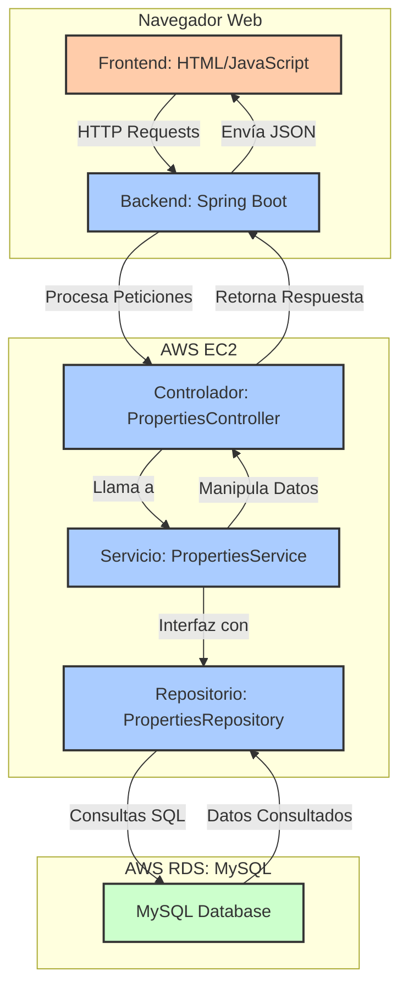

# Taller de Trabajo Individual en Patrones Arquitecturales

## Sistema de Gestión de Propiedades

Este proyecto es una aplicación web diseñada para gestionar listados de propiedades inmobiliarias mediante un sistema CRUD (Crear, Leer, Actualizar, Eliminar). El objetivo principal es proporcionar una interfaz intuitiva para que los usuarios puedan administrar la información de las propiedades de manera eficiente.

## Descripción

La aplicación permite a los usuarios realizar las siguientes operaciones:

- **Crear nuevos listados de propiedades**: Los usuarios pueden ingresar información relevante sobre las propiedades, como dirección, precio, tamaño y descripción.
- **Leer listados de propiedades**: La aplicación muestra una lista de todas las propiedades disponibles, permitiendo a los usuarios ver los detalles de cada una.
- **Actualizar detalles de propiedades existentes**: Los usuarios pueden modificar la información de las propiedades registradas.
- **Eliminar listados de propiedades**: Los usuarios tienen la opción de eliminar propiedades que ya no son relevantes.

El sistema está compuesto por un frontend desarrollado en HTML y JavaScript que se comunica con un backend RESTful construido en Spring Boot, utilizando una base de datos MySQL para el almacenamiento persistente de datos.

## Comenzando

Las siguientes instrucciones te permitirán obtener una copia del proyecto en funcionamiento en tu máquina local para fines de desarrollo y pruebas.

### Construido con:

* [Git](https://git-scm.com) - Control de versiones
* [Maven](https://maven.apache.org/download.cgi) - Manejador de dependencias
* [Java](https://www.oracle.com/java/technologies/downloads/#java22) - Lenguaje de programación

### Requisitos:

#### ⚠️ Importante

Es necesario tener instalado Git, Maven 3.9.9 y Java 17 para ejecutar el proyecto.

# Arquitectura de la Aplicación

## Cliente - Servidor



# Explicación de la Arquitectura

## Cliente (Frontend)
**Ubicación**: El frontend está desplegado en la misma instancia EC2 que el backend. Desde el navegador del usuario, el frontend (desarrollado en HTML y JavaScript) es responsable de mostrar la interfaz de la aplicación.  
**Función**: Recoge las interacciones del usuario (como llenar formularios, hacer clic en botones) y realiza solicitudes HTTP (GET, POST, etc.) al servidor.  
**Flujo**:
- El frontend utiliza fetch API o Ajax para enviar peticiones HTTP al backend en formato JSON.
- Estas peticiones son enviadas a la API del backend (por ejemplo, para consultar o agregar propiedades).

## Servidor (Backend)
**Ubicación**: El backend (Spring Boot) también está desplegado en una instancia de AWS EC2.  
**Función**:
- El backend actúa como intermediario entre el cliente (frontend) y la base de datos.
- Recibe las solicitudes HTTP del frontend, las procesa y, si es necesario, interactúa con la base de datos en AWS RDS.
- Luego, devuelve la respuesta adecuada (normalmente en formato JSON) al frontend.

**Flujo**:
- El Controlador en Spring Boot maneja la ruta de la solicitud (ej. `/api/properties`). Este controlador está asociado a las rutas definidas en la API, como obtener propiedades, agregar propiedades, etc.
- El controlador delega la lógica de negocio a los Servicios (como `PropertiesService`), que se encargan de implementar la funcionalidad requerida.
- El servicio se comunica con el Repositorio (como `PropertiesRepository`), que interactúa directamente con la base de datos.
- Después de consultar o modificar la base de datos, la respuesta viaja de vuelta al cliente a través del flujo inverso:  
  Base de datos → Repositorio → Servicio → Controlador → Frontend.

## Base de Datos (AWS RDS - MySQL)
**Ubicación**: La base de datos MySQL está en una instancia de AWS RDS separada.  
**Función**:
- La base de datos almacena todos los datos relacionados con la aplicación, como propiedades, usuarios, configuraciones, etc.
- Recibe consultas SQL desde el backend para realizar operaciones de CRUD (Crear, Leer, Actualizar, Borrar).

**Flujo**:
- Cuando el Repositorio realiza una solicitud de datos (por ejemplo, obtener todas las propiedades), ejecuta una consulta SQL en la base de datos.
- La base de datos devuelve los resultados, que son manipulados por el servicio y enviados de regreso al cliente.

# Interacción y Flujo Completo

## Cliente (Frontend):
- El usuario interactúa con la interfaz gráfica (HTML/JavaScript). Por ejemplo, al solicitar una lista de propiedades, el frontend envía una solicitud HTTP GET a `/api/properties`.

## Servidor (Backend):
- El Controlador (`PropertiesController`) en el backend recibe la solicitud y llama al Servicio (`PropertiesService`) para gestionar la lógica de negocio.
- El Servicio consulta el Repositorio (`PropertiesRepository`), que está encargado de realizar la consulta en la base de datos.

## Base de Datos (AWS RDS):
- El Repositorio genera una consulta SQL que es ejecutada en la base de datos MySQL en AWS RDS.
- La base de datos devuelve los datos solicitados al Repositorio, que a su vez los envía al Servicio, luego al Controlador, y finalmente de regreso al Frontend en formato JSON.

## Cliente (Frontend):
- El frontend recibe la respuesta JSON del servidor (con la lista de propiedades, por ejemplo) y actualiza la interfaz gráfica para mostrar los datos al usuario.

# Flujo de Peticiones
- **Peticiones GET**: Cuando el cliente solicita datos, como propiedades, se envía una petición GET desde el frontend, que sigue el flujo hacia la base de datos y retorna la información al cliente.
- **Peticiones POST**: Si el usuario agrega una nueva propiedad, el frontend envía una petición POST con los datos, que siguen el flujo inverso hasta almacenarse en la base de datos.
- **Peticiones PUT**: Cuando el usuario actualiza una propiedad existente, el frontend envía una petición PUT con los datos actualizados. El backend procesa la solicitud, actualiza la propiedad en la base de datos, y envía una respuesta al cliente.
- **Peticiones DELETE**: Si el usuario decide eliminar una propiedad, el frontend envía una petición DELETE. El backend procesa la solicitud, elimina la propiedad de la base de datos, y envía una respuesta confirmando la eliminación.

# Beneficios de la arquitectura
- **Escalabilidad**: El backend y frontend están separados, lo que permite escalarlos de manera independiente. La base de datos en AWS RDS también se puede escalar según la necesidad.
- **Separación de responsabilidades**: El frontend solo se preocupa por la presentación y la interacción del usuario, mientras que el backend gestiona la lógica de negocio y la interacción con la base de datos.
- **Modularidad**: Al tener controladores, servicios y repositorios bien definidos, puedes extender la funcionalidad del backend sin afectar otras partes del sistema.

Este diagrama y flujo reflejan cómo la arquitectura cliente-servidor funciona en tu aplicación desplegada en AWS.

# Cómo comprender el funcionamiento de las funcionalidades requeridas

### Property

Esta parte del codigo representa el modelo de datos que se va a almacenar en la base de datos. En este caso, la propiedad tiene los siguientes atributos: id, address, price, size y description. Cada propiedad tiene un identificador único (id) y una descripción, un precio, un tamaño y una dirección.

```bash
        @Entity
        @Getter @Setter
        public class Properties {
    
        @Id
        @GeneratedValue(strategy = GenerationType.AUTO)
        private Long id;
        private String address;
        private String price;
        private String size;
        private String description;
    
        /**
         * Default constructor
         */
        public Properties() {
        }
        .....
  ```
### PropertiesService

Esta clase es responsable de realizar las operaciones de CRUD (Crear, Leer, Actualizar, Borrar) sobre las propiedades. En este caso, se encarga de gestionar las operaciones de obtener, agregar, actualizar y eliminar propiedades.
```bash
  @Service
  public class PropertiesService {

    private final PropertiesRepository propertiesRepository;

    @Autowired
    public PropertiesService(PropertiesRepository propertiesRepository) {
        this.propertiesRepository = propertiesRepository;
    }

    /**
     * Method to get all properties
     * @return List of properties
     */
    public List<Properties> getAllProperties() {
        return propertiesRepository.findAll();
    }

    /**
     * Method to get a property by id
     * @param id id of the property
     * @return Properties
     */
    public Properties getPropertyById(long id){
        Optional<Properties> properties = propertiesRepository.findById(id);
        if(properties.isPresent()){
            return properties.get();
        }
        return null;
    }
    .......
  ```
### PropertiesController

Esta clase es responsable de recibir las peticiones HTTP desde el frontend y llamar a los servicios para realizar las operaciones requeridas. En este caso, se encarga de gestionar las operaciones de obtener, agregar, actualizar y eliminar propiedades.

```bash
  @RestController
  @RequestMapping(value = "/api")
  public class PropertiesController {

    private final PropertiesService propertiesService;

    @Autowired
    public PropertiesController(PropertiesService propertiesService){
        this.propertiesService = propertiesService;
    }

    /**
     * Get all properties
     * @return List of properties
     */
    @GetMapping("/properties")
    public List<Properties> getProperties(){
        return propertiesService.getAllProperties();
    }
    .....
  ```
## Demostracion de las funcionalidades

### Crear una propiedad

En esta imagen se muestra la creación de una propiedad con los siguientes datos: address, price, size y description.


### Obtener una propiedad

En esta imagen se muestra la obtención de la propiedad recien creada.


### Actualizar una propiedad

En esta imagen se muestra la actualización de la propiedad recien listada en donde se actaulizara el tamaño de la vivienda.


### Eliminar una propiedad

En esta imagen se muestra la eliminación de la propiedad recien actualizada con id 2.


En esta imagen se evidencia que ya no hay propiedades en la base de datos.


## Instalación y ejecución

Para instalar y ejecutar esta aplicación, sigue los siguientes pasos:

1. **Clonar el repositorio:**

   ```bash
   git clone https://github.com/AndresArias02/AREP-Taller5.git
   cd AREP-taller5
   ```

2. **Compilar y ejecutar:**

    ```bash

   docker-compose up --build
   mvn clean compile
   mvn exec:java '-Dexec.mainClass=edu.eci.arep.PropertiesApplication'
   
   ```

3. **Abrir la aplicación en un navegador web:**

   Navega a http://localhost:8080 para interactuar con la aplicación.

## Video de prueba de la aplicación subida en AWS en una instancia EC2

[VIDEO AWS EC2 Y RDS](https://youtu.be/4cTEwPaZcc8)

## Ejecutando las pruebas

Para ejecutar las pruebas, ejecute el siguiente comando:

```bash
mvn test
```

## versionamiento


## Autores

- Andrés Arias - [AndresArias02](https://github.com/AndresArias02)

## Licencia

[](https://opensource.org/licenses/MIT)

Este proyecto está bajo la Licencia (MIT) - ver el archivo [LICENSE](LICENSE.md) para ver más detalles.

## Agradecimientos

- Al profesor [Luis Daniel Benavides Navarro](https://ldbn.is.escuelaing.edu.co) por compartir sus conocimientos.
    
# AREP-Taller6
